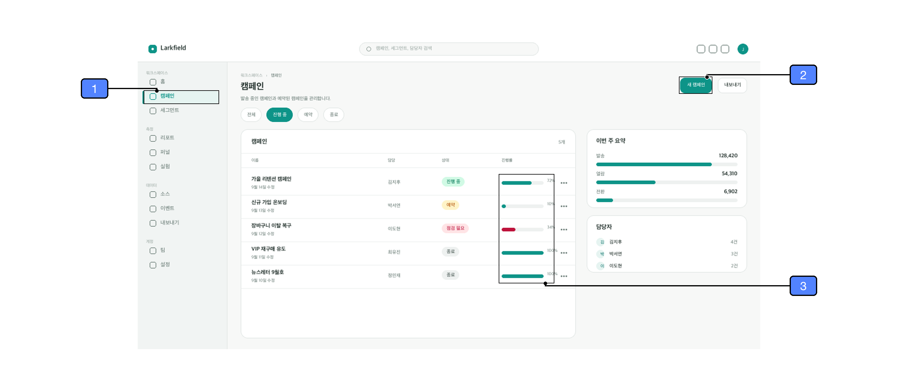
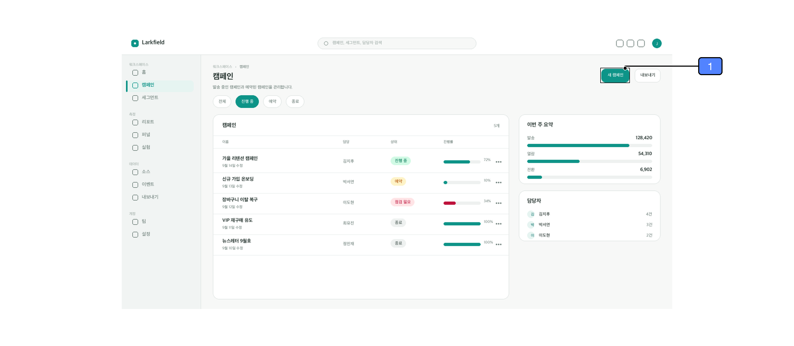
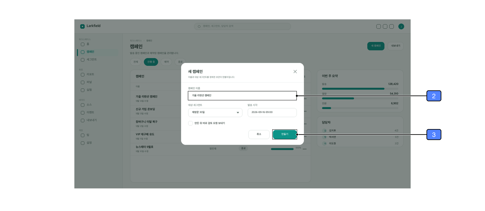
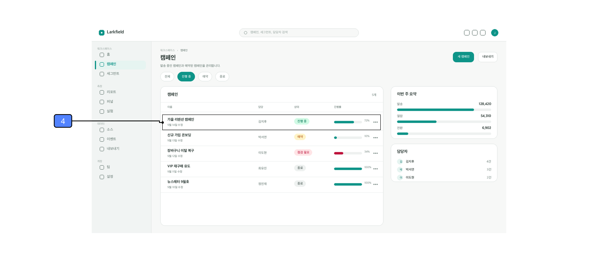

# screenshot-annotator

> Annotate screenshots for documentation — region outlines, leader lines, numbered callout badges.
> **English**: [`README.en.md`](README.en.md)

스크린샷에 영역선과 지시선, 번호 배지를 그려 주는 Claude 스킬입니다.
매뉴얼에서 "①을 클릭하세요" 같은 식으로 화면을 짚어 설명할 때 쓰시면 됩니다.

좌표는 프리뷰를 보고 짐작하는 대신 픽셀에서 재고, 지시선은 겹치지 않게 배선하고,
그리기 전에 검증합니다. **Figma가 없어도 PNG로 받을 수 있습니다.**

---

## 설치

```
/plugin marketplace add seonhwakei/screenshot-annotator
/plugin install screenshot-annotator@screenshot-annotator
```

클론해서 쓰시려면:

```bash
git clone https://github.com/seonhwakei/screenshot-annotator.git
cd screenshot-annotator && ./install.sh
```

스킬 없이 스크립트만 돌리셔도 됩니다. 필요한 건 **파이썬 3.9 이상과 `pillow`, `numpy`뿐**입니다.

```bash
pip install pillow numpy
export S=/path/to/screenshot-annotator/skills/screenshot-annotator/scripts
```

배지 숫자는 Inter Semi Bold로 그립니다. 없으면 시스템 폰트로 대체됩니다.
맞추시려면 `export CALLOUT_FONT=/path/to/Inter-SemiBold.ttf`.

---

## 유즈케이스

### 1. 화면 전체를 설명할 때

짚을 요소만 골라 주시면 번호는 위치를 보고 자동으로 매깁니다.
왼쪽 열을 위에서 아래로, 그다음 오른쪽 열을 위에서 아래로 갑니다.
화면 구성 표를 만들 때 쓰는 방식입니다.


### 2. 절차서를 만들 때

문장이 가리킨 것만 번호를 받게 할 수 있습니다.

```
캠페인(마크업)을 클릭해 캠페인 관리 화면에 진입하세요.
새 캠페인(마크업)을 클릭해 만들기 창을 여세요.
진행률(마크업)을 확인하세요.
```

같은 화면인데 전체 마크업이면 8개가 잡히고, 여기서는 3개만 잡힙니다.
번호가 문장 순서를 따라야 하므로 `--keep-numbers`를 씁니다.



### 3. 한 절차가 화면 여러 장에 걸칠 때

번호를 이미지 사이로 이어서 매깁니다.

```
1. 새 캠페인(이미지1-①)을 클릭해 만들기 창을 여세요.
2. 캠페인 이름(이미지2-②)을 입력하고 만들기(이미지2-③)를 클릭하세요.
3. 목록에 새 캠페인(이미지3-④)이 추가되었는지 확인하세요.
```

<table>
<tr>
<td></td>
<td></td>
<td></td>
</tr>
<tr>
<td align="center">이미지 1 — ①</td>
<td align="center">이미지 2 — ② ③</td>
<td align="center">이미지 3 — ④</td>
</tr>
</table>

```
STEP1|LIST |1,새 캠페인,905,69,55,28
STEP2|MODAL|2,이름,352,223,336,28;3,만들기,613,342,76,30
STEP3|LIST |4,추가된 행,178,228,547,38
```

### 4. 다크 UI를 설명할 때

어두운 구간을 지나는 선과 박스에만 흰 테두리가 자동으로 붙습니다.
밝은 곳에는 붙지 않으니 밝고 어두운 영역이 섞인 화면에서도 그대로 쓰시면 됩니다.


### 5. 딤 위에 뜬 창을 설명할 때

딤된 배경 때문에 창 경계를 잡기 까다로운데, `modal` 모드가 창만 정확히 집어 냅니다.
안쪽 입력 칸은 `outline`, 채움 버튼은 `solid`로 짚습니다.


### 6. 아직 화면에 없는 것을 가리켜야 할 때

저장 완료 안내처럼 조건이 맞아야 뜨는 요소는 캡처에 없습니다.
이럴 때는 점선으로 "여기에 표시됩니다"를 나타냅니다. 실선과 구분되니 오해가 없습니다.


### 7. Figma를 함께 쓸 때

4단계까지는 똑같이 하고 그리기만 Figma로 넘깁니다. 좌표와 스타일이 같아 결과도 같습니다
(같은 프레임을 양쪽으로 그려 비교했을 때 픽셀 차이 0.8%, 전부 안티에일리어싱이었습니다).

그린 뒤 도형을 직접 옮겨 미세 조정할 수 있고 캡처를 교체해도 마크업이 남습니다.
측정은 반드시 **Figma가 렌더한 export 위에서** 하세요. 원본으로 재면 `scaleMode: FILL`이
잘라 낸 만큼 어긋납니다. 스니펫은 [`references/figma-plugin.md`](skills/screenshot-annotator/references/figma-plugin.md).

### 8. Word 매뉴얼과 맞출 때

```bash
python3 $S/extract_docx.py manual.docx out/                  # 문서의 번호·라벨을 정답으로 읽기
python3 $S/sync_docx.py manual.docx new.docx png/ map.json   # 렌더 결과를 문서에 반영
```

번호의 정답은 문서 쪽입니다. Word가 저장할 때마다 미디어 파일 이름을 바꾸기 때문에
파일명 대신 **캡션 순서**로 대응시킵니다.

---

## 커버리지

### 다룰 수 있는 요소

짚고 싶은 요소마다 **대충 감싼 박스와 종류(MODE)** 를 주시면 정확한 사각형은 도구가 찾습니다.

| MODE | 대상 |
|---|---|
| `ink` | 글자, 값, 상태 배지, 아이콘 |
| `solid` | 단색으로 채운 버튼, pill, 아바타 |
| `card` | 카드, 표 전체, 패널 |
| `nav` | 왼쪽 메뉴 항목 (다크·밝은 레일 모두) |
| `row` `band` | 목록의 한 행 |
| `panel` | 오른쪽에서 밀려 나오는 패널 |
| `modal` | 딤 위에 뜬 창 |
| `outline` | 흰 바탕 위의 테두리 항목 |

### 표현 수준

| 수준 | 어디에 쓰이나 | PNG | Figma |
|---|---|---|---|
| **L1** 기본 | 유즈케이스 1·2·3·5 | O | O |
| **L2** 다크 대응 | 유즈케이스 4 | O | O |
| **L3** 표시 자리 | 유즈케이스 6 | 점선 O, 모형은 `extra.json` | O |
| **L4** 확대 도해 | 표 안의 작은 컨트롤 | `extra.json`의 `zoom` | O |
| **L5** 상태 카탈로그 | 한 지점의 상태가 여러 개 | 수동 | O |
| **L6** 조건 대조 | 빈 상태와 데이터 있는 상태 | 수동 | O |

### 실행

작업 디렉터리에 `img/HOME.png` 한 장을 두고 다섯 단계를 돌리시면 됩니다.

```bash
# 1. 좌표 재기 — seed는 대충 줘도 됩니다
python3 $S/fit.py img/HOME.png --batch "nav,8,92,128,22;solid,906,70,112,26;card,400,460,20,14"
#    nav   11  92 125  22
#    solid 905  69  55  28
#    card  176 155 551 351

# 2. 검증 — 빈 박스·겹침·이미지 밖·과대 박스를 걸러 냅니다
python3 $S/verify.py spec.json          # -> 0 findings 가 될 때까지

# 3. 지시선 배선
python3 $S/route.py .                   # -> cross=0 ovl=0 ink=0 이어야 합니다

# 4. 번호 부여 (왼쪽 위→아래, 다음 오른쪽)
python3 $S/build.py .                   # 번호를 고정하려면 --keep-numbers

# 5. 렌더
python3 $S/render.py . --scale 2        # -> out/HOME.png
```

이미지가 1040×524가 아니면 배치를 적어 주시면 됩니다. `HOME|HOME@230,60,1040,585|...`

위 유즈케이스 이미지는 전부 [`examples/`](examples/)에서 이 명령들로 만든 것입니다.
`spec.json`과 `areas.txt`를 그대로 복사해 실행하면 재현됩니다.

---

## 한계

- 어떤 요소를 짚을지는 사람이나 에이전트가 정합니다. 도구는 정확한 사각형을 찾아 줄 뿐입니다.
- 이미지 비율이 1040:524에서 많이 벗어나면 배치를 직접 적어 주셔야 합니다(`@x,y,w,h`).
- 캡처가 옛날 것이면 좌표를 맞춰도 설명과 어긋납니다. 이건 도구가 잡지 못합니다.

---

`examples/`의 스크린샷은 실제 제품이 아니라 이 저장소를 위해 합성한 가상 화면입니다.
