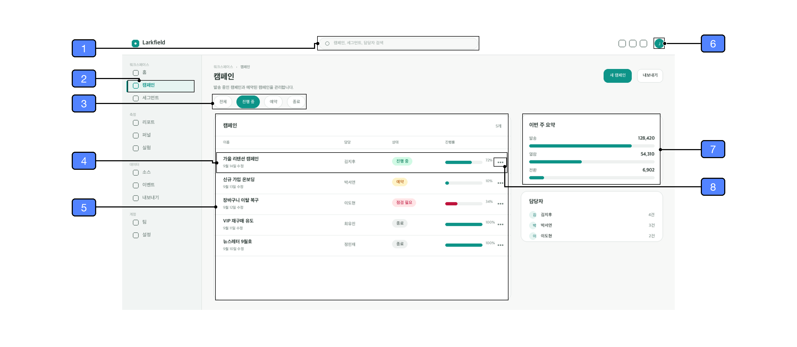
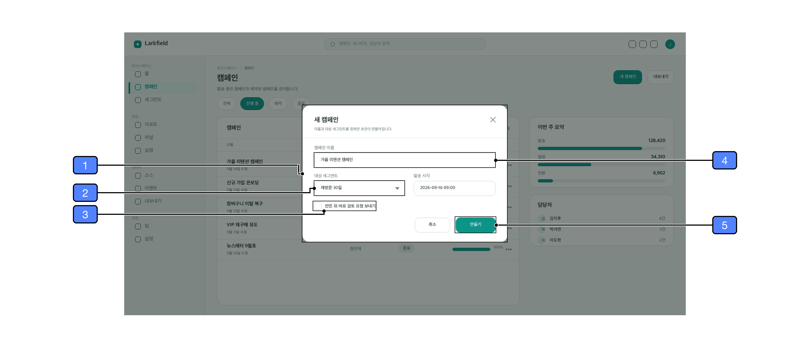
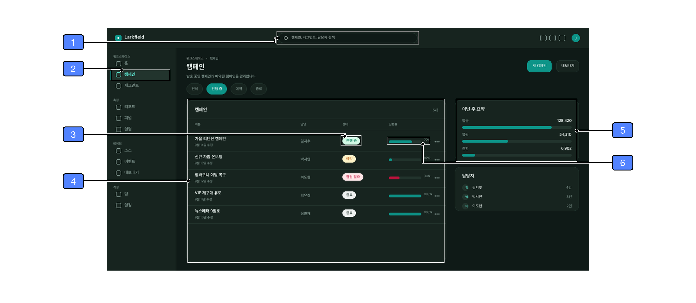
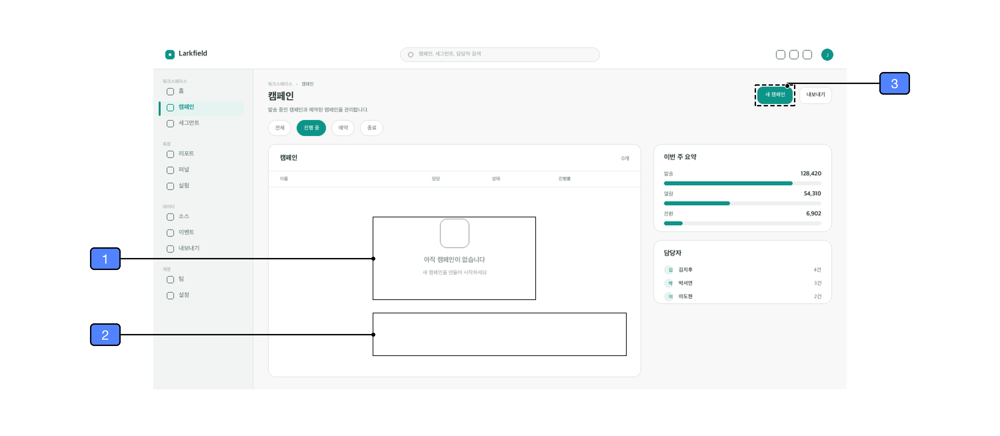

# screenshot-annotator

> Annotate screenshots for documentation — region outlines, leader lines, numbered callout badges.
> Coordinates measured from pixels · leader lines routed without overlap · verified before drawing.

**스크린샷에 영역선 + 리더선 + 번호 배지를 그리는 Claude 스킬.**
매뉴얼·도움말·릴리스 노트에서 "①을 클릭하세요" 형태로 화면을 설명할 때 쓴다.

핵심은 그리기가 아니라 **어긋나지 않게 하는 것**이다. 좌표는 픽셀에서 재고, 리더선은
겹치지 않게 배선하고, 그리기 전에 검증한다. 같은 입력이면 항상 같은 그림이 나온다.

**Figma 없이 PNG만으로 쓸 수 있고, Figma가 있으면 같은 좌표로 Figma에도 그린다.**

<p align="center">
  
</p>

---

## 무엇이 다른가

| | 직접 그릴 때 | 이 스킬 |
|---|---|---|
| 좌표 | 축소 프리뷰 눈대중 | 요소 종류별로 픽셀에서 측정 |
| 리더선 | 배지 → 박스 직선 (서로 교차) | 격자 배선, 교차·겹침 0 |
| 다크 배경 | 선이 묻힘 | 어두운 구간만 흰 halo 자동 |
| 번호 | 손으로 부여 | 위치 기준 자동 (좌측 위→아래, 다음 우측) |
| 검증 | 눈으로 | 빈 박스·겹침·이미지 밖·과대 박스를 코드로 |

---

## 설치

### Claude Code — 플러그인 마켓플레이스 (권장)

```
/plugin marketplace add seonhwakei/screenshot-annotator
/plugin install screenshot-annotator@screenshot-annotator
```

### 클론 + 심링크

```bash
git clone https://github.com/seonhwakei/screenshot-annotator.git
cd screenshot-annotator
./install.sh          # ~/.claude/skills/screenshot-annotator 로 심링크 + 의존성 확인
```

### 스크립트만 쓰기 (에이전트 없이)

스킬을 설치하지 않고 `scripts/`의 파이썬만 직접 돌려도 된다.

```bash
pip install pillow numpy
export S=/path/to/screenshot-annotator/skills/screenshot-annotator/scripts
```

**필요한 것은 파이썬 3.9+ 와 `pillow`, `numpy` 뿐이다.** Figma는 선택이다.

배지 숫자는 Inter Semi Bold를 쓴다. 없으면 시스템 산세리프로 대체되며, 맞추려면:

```bash
export CALLOUT_FONT=/path/to/Inter-SemiBold.ttf
```

---

## 빠른 시작

작업 디렉터리에 스크린샷 하나만 두고 시작한다.

```
work/
  img/HOME.png      # 가로:세로 = 1040:524 (약 1.985) 권장
```

### 1. 요소 좌표 재기

찍고 싶은 요소마다 **대충 감싼 seed 박스**와 **요소 종류(MODE)** 를 준다.
종류를 말해 주는 게 이 도구의 전부다 — 종류가 다르면 재는 방법이 다르다.

```bash
cd work
python3 $S/fit.py img/HOME.png --batch "\
nav,8,92,128,22;\
solid,906,70,112,26;\
card,400,460,20,14;\
row,178,228,547,38;\
ink,368,9,304,26"
```

```
nav   11  92 125  22  nav        # 왼쪽 메뉴 항목
solid 905  69  55  28  solid     # 단색 채움 버튼
card  176 155 551 351  card      # 카드 / 표 전체
row   178 221 547  45  row       # 목록의 한 행
ink   368   9 304  26  ink       # 글자·값·배지·아이콘
```

seed는 대충 줘도 된다. 위에서 `nav`는 `8,92,128,22`로 줬지만 실제 항목인
`11,92,125,22`가 나왔다 — **어디쯤인지만 알려 주면 정확한 사각형은 도구가 찾는다.**

| MODE | 대상 |
|---|---|
| `ink` | 글자, 값, 상태 배지, 아이콘 — seed 밖으로 절대 안 자람 |
| `solid` | 단색 채움 버튼, pill, 아바타 |
| `card` | 카드, 표 전체, 패널 |
| `nav` | 왼쪽 메뉴 항목 (다크·라이트 레일 모두) |
| `row` / `band` | 목록의 한 행 |
| `panel` | 오른쪽 슬라이드오버 |
| `modal` | 딤 위에 뜬 창 |
| `outline` | 흰 바탕 위 테두리 항목 |

레일 폭 자동 탐지가 틀리면 `nav@150` 처럼 직접 지정한다.
종류가 애매하면 범용 보정기 `snap.py`를 쓴다.

### 2. 검증 (그리기 전에)

```bash
cat > spec.json <<'EOF'
{"HOME": {"img": "img/HOME.png", "boxes": [
  [1,368,9,304,26], [2,11,92,125,22], [3,905,69,55,28],
  [4,176,155,551,351], [5,178,228,547,38]
]}}
EOF

python3 $S/verify.py spec.json
```

```
-- 1 frames, 0 with findings
```

0건이 아니면 고친다. 잡아 주는 것:

- `empty` 빈 공간을 가리킴 · `overlap` 박스끼리 부분 겹침
- `coarse` 화면의 절반 이상 · `outside` 이미지 밖 · `tiny` 너무 작음

일부러 비워 두는 박스(아직 화면에 없는 안내 문구 자리)는 의도를 적는다:

```json
{"HOME": {"img": "...", "boxes": [...], "dash": [5]}}
```

### 3. 배선

```bash
cat > areas.txt <<'EOF'
HOME|HOME|1,검색,368,9,304,26;2,메뉴,11,92,125,22;3,버튼,905,69,55,28;4,카드,176,155,551,351;5,행,178,228,547,38
EOF

python3 $S/route.py .
```

```
HOME           n= 5 cross=0 ovl=  0 ink=   0 len= 1109
```

`cross`(리더선 교차) `ovl`(겹침) `ink`(글자 위를 지남)이 전부 0이어야 한다.
0이 아니면 영역을 줄이거나 나눈다.

이미지가 1040×524가 아니면 배치를 적는다: `HOME|HOME@230,60,1040,585|...`

### 4. 번호 부여 + halo 판정

```bash
python3 $S/build.py .
```

번호는 **왼쪽 열 위→아래, 그다음 오른쪽 열 위→아래**로 다시 매겨진다.
문서나 명령문이 이미 번호를 참조하고 있으면 그대로 두는 `--keep-numbers`를 쓴다.

### 5. 렌더

```bash
python3 $S/render.py . --scale 2
```

```
HOME     out/HOME.png  3000x1308  a=5 b=5 halo=2
```

끝. `out/HOME.png`가 결과물이다.

> 위 다섯 명령은 그대로 복사해 실행하면 재현된다. `examples/`에 같은 절차로 만든
> 입력·설정·출력이 전부 들어 있다.

---

## 예시

`examples/`에서 `python3 $S/render.py .` 로 재현할 수 있다.

| | |
|---|---|
| <br>**딤 위의 창** — `modal` `outline` | <br>**다크 UI** — 어두운 구간만 halo 자동 |
| <br>**표시 자리** — 화면에 없는 안내를 점선으로 | <br>**목록 화면** — 한 화면에 5개 모드 |

---

## 명령 기반 마크업

"화면의 모든 요소"가 아니라 **문장이 지시한 것만** 번호를 받게 할 수 있다.
절차서에서 주로 이 방식을 쓴다.

```
캠페인(마크업)을 클릭해 캠페인 관리 화면에 진입하세요.
새 캠페인(마크업)을 클릭해 만들기 창을 여세요.
진행률(마크업)을 확인하세요.
```

→ 세 개만 잡는다. 전체 마크업이었다면 8개가 잡혔을 화면이다.
번호는 문장 순서를 따라야 하므로 이때는 `--keep-numbers`를 쓴다.

### 여러 이미지에 이어지는 번호

한 절차가 화면 여러 장에 걸치면 번호를 이어서 매긴다.

```
1. 새 캠페인(이미지1-①)을 클릭해 만들기 창을 여세요.
2. 캠페인 이름(이미지2-②)을 입력하고 만들기(이미지2-③)를 클릭하세요.
3. 목록에 새 캠페인(이미지3-④)이 추가되었는지 확인하세요.
```

```
STEP1|LIST |1,새 캠페인,905,69,55,28
STEP2|MODAL|2,이름,352,223,336,28;3,만들기,613,342,76,30
STEP3|LIST |4,추가된 행,178,228,547,38
```

---

## Figma와 함께 쓰기

Figma MCP가 있으면 4단계까지 똑같이 하고 그리기만 Figma로 보낸다.
**좌표와 스타일이 같아서 두 결과는 일치한다** — 같은 프레임을 양쪽으로 그려
비교했을 때 픽셀 차이 0.8%, 전부 폰트 안티에일리어싱이었다.

```
1~4단계 (동일) → build.py → draw.json
                              ├─ render.py      → out/*.png
                              └─ Figma 플러그인  → 파일 안 프레임
```

Figma로 그릴 때의 이점:

- 그린 뒤 **도형을 직접 옮겨** 미세 조정할 수 있다
- 캡처를 교체해도 마크업이 남는다 (`imageHash`만 교체)
- 디자이너와 같은 파일에서 리뷰

스니펫과 함정은 `skills/screenshot-annotator/references/figma-plugin.md`.
측정은 **반드시 Figma가 렌더한 export 위에서** 한다 — 원본 이미지로 재면
`scaleMode: FILL`의 크롭 때문에 어긋난다.

---

## 표현 수준

| 수준 | 언제 | render.py | Figma |
|---|---|---|---|
| **L1** 기본 | 요소가 화면에 다 보임 | O | O |
| **L2** 다크 대응 | 다크 UI·모달 딤 (halo 자동) | O | O |
| **L3** 표시 자리 | 아직 화면에 없는 안내·오류 문구 | 점선 O, 모형은 `extra.json` | O |
| **L4** 확대 도해 | 표 안 작은 컨트롤 | `extra.json`의 `zoom` | O |
| **L5** 상태 카탈로그 | 한 지점의 상태가 여러 개 | 수동 | O |
| **L6** 조건 대조 | 빈 상태 ↔ 데이터 있는 상태 | 수동 | O |

---

## Word 매뉴얼 연동 (선택)

`.docx` 매뉴얼을 쓰고 있다면 양방향으로 맞출 수 있다.

```bash
python3 $S/extract_docx.py manual.docx out/   # 문서의 번호·라벨을 정답으로 읽기
python3 $S/sync_docx.py manual.docx new.docx png/ map.json   # 렌더를 문서에 반영
```

문서가 번호의 정답이다. 파일명에 의존하지 않고(Word가 저장할 때마다 미디어를
renaming한다) **캡션 순서**로 대응시킨다.

---

## 저장소 구조

```
skills/screenshot-annotator/
  SKILL.md          에이전트용 지침 (불변식 · 워크플로우 · 실패 사례)
  scripts/
    fit.py          요소 종류별 좌표 측정        ← 여기서 시작
    snap.py         종류를 모를 때의 범용 보정
    resolve.py      부분 겹침 해소
    verify.py       그리기 전 검증
    route.py        리더선 배선
    build.py        번호 부여 + halo 판정
    render.py       PNG 출력                    ← Figma 없이 쓰는 끝점
    router.py       배선 엔진 (직접 호출 안 함)
    extract_docx.py Word 매뉴얼에서 번호·라벨 읽기
    sync_docx.py    결과를 Word 매뉴얼에 반영
  references/
    style.md          스타일 사전 (색·크기·두께)
    figma-plugin.md   Figma 그리기 스니펫과 함정
    subagent.md       영역 도출을 병렬로 맡길 때의 프롬프트
examples/           입력 · 설정 · 출력 (재현 가능)
```

---

## 한계

- 어떤 요소를 짚을지는 **사람 또는 에이전트가 정한다**. 도구는 "그 요소의 정확한
  사각형"을 찾아 줄 뿐이다.
- 이미지 비율이 1040:524에서 크게 벗어나면 배치를 명시해야 한다(`@x,y,w,h`).
- L5·L6은 도형 조립이라 파일 렌더에서는 수동이다.
- 캡처가 구버전이면 좌표를 아무리 맞춰도 설명과 어긋난다. 이건 도구가 못 잡는다 —
  `SKILL.md` §6-5의 점검 순서를 따른다.

---

## 라이선스

MIT. `examples/`의 스크린샷은 실제 제품이 아니라 이 저장소를 위해 합성한 가상 화면이다.
